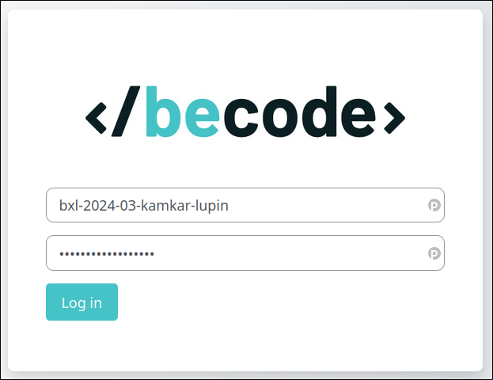
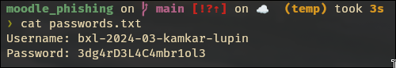
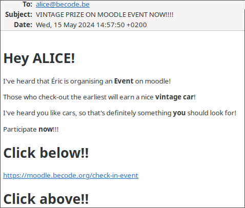
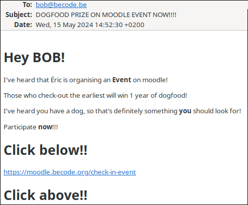

# moodle_phishing
## What is it ?
Phishing website (for educational purposes) imitating the moodle login page of
[Becode](https://moodle.becode.org/login/index.php). When submiting the login credentials,
the request get sent to a webhook which will run a bash script. This bash script simply
retrieve the payload, and stores the credentials in a `passwords.txt` file.

## Requirements
- A webhook (for example https://github.com/adnanh/webhook)
- Becode classmates

## Screenshots

## Try it!
You can try it via this [website link](https://jeanmadao.github.io/moodle_phishing/).
Don't put your actual credentials (-_-).
